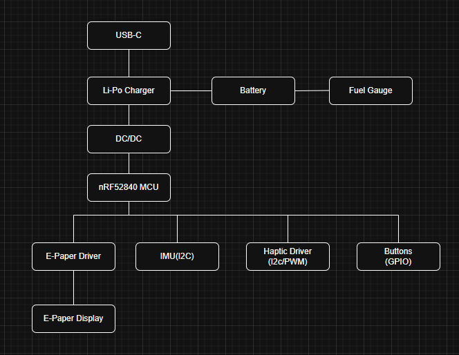

# David Adrian-Mario

## Overview

Acest proiect consta intr-un dispozitiv embedded portabil bazat pe **nRF52840**, capabil sa controleze un display **E-Paper**, sa colecteze date de la un **IMU**, sa ofere feedback prin **haptic driver**, si sa functioneze autonom pe baterie Li-Po.

Dispozitivul include:

* alimentare Li-Po + incarcare USB-C
* conversie DC/DC
* control display e-paper
* senzor IMU
* fuel gauge pentru baterie
* interfata utilizator (butoane + vibratii)
* debugging prin SWD

---
## Materiale

## Block Diagram

## Functionalitate Hardware

### Alimentare

* Intrare: USB-C (5V)
* incarcare baterie Li-Po prin IC dedicat
* Fuel gauge monitorizeaza:
  
  * tensiune
  * nivel baterie
  * estimare autonomie

### DC/DC

* Conversie de la baterie (~3.7V) la 3.3V stabil
* Alimentare pentru MCU si periferice
* Optimizat pentru consum redus

---

### MCU – nRF52840

Roluri:

* control general sistem
* comunicare I2C/SPI
* control display e-paper
* citire senzori
* BLE (optional)

---

### E-Paper

* Controlat prin SPI
* Necesita:

  * tensiuni multiple generate de circuit dedicat (boost + diode)
* Avantaj:

  * consum foarte mic (doar la refresh)

---

### IMU

* Conectat pe I2C
* Masoara:

  * acceleratie
  * rotatie

---

### Haptic

* Driver dedicat (DRV2605)
* Control prin I2C
* Feedback tactil pentru UI

---

### Butoane

* 3 butoane:

  * UP
  * DOWN
  * ENTER
* Conectate la GPIO
* Pull-up/pull-down hardware

---
### USB + ESD

* USB-C pentru alimentare
* Protectie ESD pentru:

  * D+
  * D-
  * VBUS

---

### SWD

* Interfata debugging:

  * SWDIO
  * SWCLK
  * RESET

---

## Mapare pini nRF52840

| Functie        | Pin MCU | Motiv                |
| -------------- | ------- | -------------------- |
| SPI E-Paper    | P0.x    | viteza mare necesara |
| I2C IMU        | P0.x    | standard I2C         |
| I2C Fuel Gauge | P0.x    | bus comun            |
| I2C Haptic     | P0.x    | bus comun            |
| Buttons        | P0.x    | GPIO simplu          |
| SWDIO          | dedicat | debugging            |
| SWCLK          | dedicat | debugging            |
| RESET          | dedicat | control              |

**Motivatie design:**

* I2C shared → reduce pini
* SPI separat → performanta display
* GPIO dedicate → simplitate

---

## Consum de energie (estimare)

| Modul           | Consum           |
| --------------- | ---------------- |
| MCU activ       | ~5-10 mA         |
| MCU sleep       | <10 µA           |
| E-paper refresh | 20-50 mA (scurt) |
| IMU             | ~1-3 mA          |
| Haptic          | ~100 mA (peak)   |

### Optimizari:

* sleep mode agresiv
* e-paper doar la update
* oprire periferice nefolosite

---

## Design PCB

### Observatii:

* Layout compact, dens
* Separare:

  * analog (power)
  * digital (MCU)
* Ground plane continuu
* Trasee scurte pentru:

  * SPI
  * I2C

### Consideratii:

* decuplare langa fiecare IC
* trasee groase pentru power
* protectie ESD langa conector
